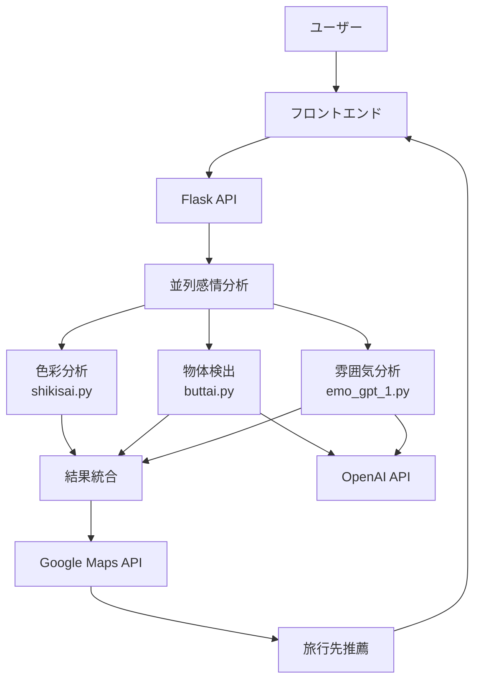

# 🌟 EMOTABI - 感情と旅が出会う場所

[](https://opensource.org/licenses/MIT)
[](https://www.python.org/downloads/)
[](https://flask.palletsprojects.com/)
[](https://openai.com/)

**EMOTABI**は、アップロードされた写真から感情を分析し、その感情に基づいて旅行先を推薦するAI搭載Webアプリケーションです。

## 主な機能

### 3つのAI感情分析エンジン
- **色彩分析**: K-meansクラスタリングで画像の主要色から感情を判定
- **物体検出**: YOLOv8で物体を検出し、OpenAI APIで感情を取得
- **雰囲気分析**: GPT-4o-mini Vision APIで画像全体の雰囲気を分析

### インテリジェント旅行先推薦
- 感情分析結果に基づく旅行先の自動推薦
- Google Maps Places API連携
- 詳細な観光地情報とレビュー表示

### モダンなユーザーインターフェース
- レスポンシブデザイン（デスクトップ・モバイル対応）
- ドラッグ&ドロップ画像アップロード
- リアルタイム分析結果表示

##  クイックスタート

### 前提条件
- Python 3.9以上
- OpenAI API キー
- Google Maps API キー

### 1. リポジトリのクローン
```bash
git clone https://github.com/yourusername/emotabi.git
cd emotabi
```

### 2. 依存関係のインストール
```bash
pip install -r requirements.txt
```

### 3. 環境変数の設定
```bash
# .env ファイルを作成
cp .env.example .env

# APIキーを設定
OPENAI_API_KEY=your_openai_api_key_here
GOOGLE_MAPS_API_KEY=your_google_maps_api_key_here
```

### 4. アプリケーションの起動
```bash
python app.py
```

##  システム構成



## 🔧 技術スタック

### フロントエンド
- **HTML5/CSS3**: モダンなUIデザイン
- **JavaScript (ES6+)**: 非同期通信・インタラクション
- **Bootstrap**: レスポンシブレイアウト

### バックエンド
- **Python 3.9+**: メイン言語
- **Flask 2.3+**: Webフレームワーク
- **OpenCV**: 画像処理
- **scikit-learn**: 機械学習（K-means）
- **ultralytics**: YOLOv8物体検出

### AI/機械学習
- **OpenAI GPT-4o-mini**: Vision API、感情分析
- **YOLOv8 Nano**: リアルタイム物体検出
- **K-means**: 色彩クラスタリング

### 外部API
- **OpenAI API**: 画像解析・感情生成
- **Google Maps Places API**: 旅行先検索|

##  デプロイメント（Render + GitHub 連携）

このプロジェクトは Render の GitHub 連携を前提としています。リポジトリに含まれる `render.yaml` と `Dockerfile` により、Render 側で自動的に設定・デプロイが行われます。

### 手順（最短）
1. GitHub にソースコードをプッシュ
2. Render にログイン → New → Blueprint から対象リポジトリを選択
3. プレビューで `render.yaml` を確認し、そのまま「Apply」
4. サービス作成後、ダッシュボードの Environment に以下を設定
   - `OPENAI_API_KEY`: OpenAIのAPIキー
   - `GOOGLE_MAPS_API_KEY`: Google Maps Places APIキー
   - `SECRET_KEY`: 任意（`render.yaml` では自動生成にも対応）
5. Deploy（ヘルスチェックは `/health`）

### Render 側の設定ポイント
- デプロイ方式: Docker（`env: docker`）
- Dockerfile パス: `./Dockerfile`
- ヘルスチェック: `/health`
- 自動デプロイ: GitHub に push で自動（`autoDeploy: true`）

### 環境変数の注意
- すべて Render の「Environment」から設定してください
- `.env` はローカル開発用。BOMなしUTF-8、値にクォート不要
- アプリ内では `python-dotenv` の `override=True` により `.env` が最優先（ローカルのみ）

### ローカルでのDocker動作（任意）
```bash
# イメージビルド
docker build -t emotabi .

# コンテナ実行
docker run -p 5000:5000 \
  -e OPENAI_API_KEY=your_key \
  -e GOOGLE_MAPS_API_KEY=your_key \
  emotabi
```

## 📖 ドキュメント

-  **[システム概要](./docs/1.全体のシステム構成.md)** - アーキテクチャと技術構成
-  **[物体検出システム](./docs/2.buttai.pyの仕組み.md)** - YOLOv8による物体検出の詳細
-  **[色彩分析システム](./docs/3.shikisai.pyの仕組み.md)** - K-meansクラスタリングによる色彩分析
-  **[雰囲気分析システム](./docs/4.emo_gptの仕組み.md)** - OpenAI Vision APIによる感情分析
-  **[デプロイガイド](./docs/5.デプロイ・web公開関係.md)** - 本番環境構築とCI/CD

## 🔑 API キーの取得

### OpenAI API
1. [OpenAI Platform](https://platform.openai.com/) にアクセス
2. アカウント作成・ログイン
3. 「API Keys」でキーを作成
4. 請求情報を設定（従量課金）

### Google Maps API
1. [Google Cloud Console](https://console.cloud.google.com/) にアクセス
2. プロジェクトを作成
3. Places API を有効化
4. 認証情報でAPIキーを作成

## 🛡️ セキュリティ

- ✅ 環境変数によるAPIキー管理
- ✅ ファイルサイズ制限（16MB）
- ✅ 許可ファイル形式チェック（JPG, PNG, GIF）
- ✅ エラー情報の適切な隠蔽
- ✅ HTTPS強制（本番環境）

## 🧪 テスト

```bash
# テスト実行
python -m pytest tests/ -v

# カバレッジ確認
python -m pytest --cov=. tests/
```

##  コントリビューション

プルリクエストやイシューの報告を歓迎します！

### 開発の流れ
1. このリポジトリをフォーク
2. フィーチャーブランチを作成 (`git checkout -b feature/amazing-feature`)
3. 変更をコミット (`git commit -m 'Add amazing feature'`)
4. ブランチにプッシュ (`git push origin feature/amazing-feature`)
5. プルリクエストを作成

### 開発ガイドライン
- コードスタイル: PEP 8
- コミットメッセージ: [Conventional Commits](https://www.conventionalcommits.org/)
- テスト: 新機能には必ずテストを追加

##  ライセンス

このプロジェクトは [MIT License](LICENSE) の下で公開されています。

##  謝辞

- [OpenAI](https://openai.com/) - GPT-4o-mini Vision API
- [Ultralytics](https://ultralytics.com/) - YOLOv8
- [Google](https://developers.google.com/maps) - Maps Places API
- [Flask](https://flask.palletsprojects.com/) - Webフレームワーク

